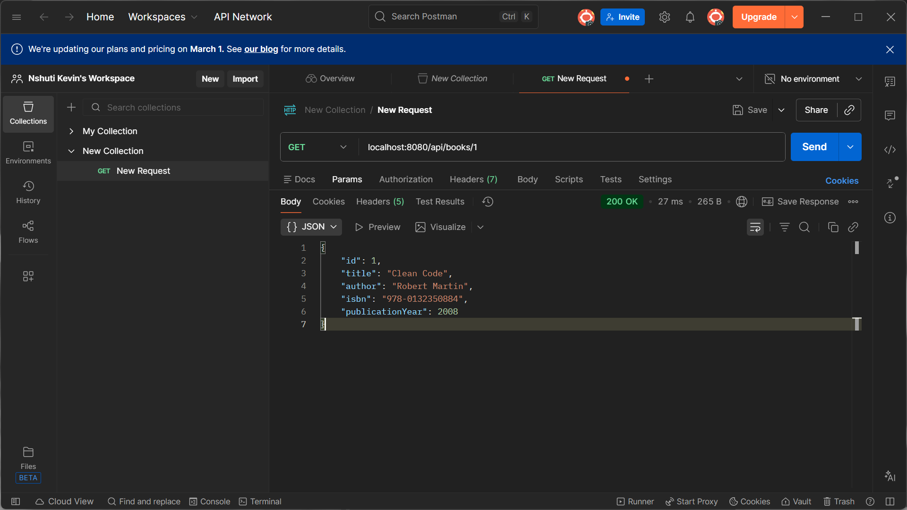

# Library Book Management API

A RESTful API for managing a simple library book catalog built with Spring Boot.

## 📋 Table of Contents
- [Features](#features)
- [Technologies Used](#technologies-used)
- [Prerequisites](#prerequisites)
- [How to Run the Application](#how-to-run-the-application)
- [API Endpoints](#api-endpoints)
- [Sample Requests and Responses](#sample-requests-and-responses)

## ✨ Features

- Retrieve all books in the library
- Get a specific book by ID
- Search books by title
- Add new books to the library
- Delete books from the library
- RESTful API design with proper HTTP methods and status codes

## 🛠 Technologies Used

- **Java 17+**
- **Spring Boot 3.x**
- **Spring Web**
- **Maven**
- **Postman** (for API testing)

## 📦 Prerequisites

Before running this application, make sure you have the following installed:

- Java Development Kit (JDK) 17 or higher
- Maven 3.6+
- Your favorite IDE (IntelliJ IDEA, Eclipse, VS Code, etc.)
- Postman (optional, for testing endpoints)

## 🚀 How to Run the Application

### Step 1: Clone the Repository
```bash
git clone https://github.com/nshutiii/restFull_api_26663.git
cd Library-Management
```

### Step 2: Build the Project
```bash
mvn clean install
```

### Step 3: Run the Application
```bash
mvn spring-boot:run
```

Alternatively, you can run the application from your IDE by running the main application class.

### Step 4: Access the API
The application will start on `http://localhost:8080`

## 📡 API Endpoints

| Method | Endpoint | Description |
|--------|----------|-------------|
| GET | `/api/books` | Get all books |
| GET | `/api/books/{id}` | Get a book by ID |
| GET | `/api/books/search?title={title}` | Search books by title |
| POST | `/api/books` | Add a new book |
| DELETE | `/api/books/{id}` | Delete a book by ID |

## 📝 Sample Requests and Responses

### 1. Get All Books
**Request:**
```http
GET http://localhost:8080/api/books
```

**Response:** `200 OK`
```json
[
  {
    "id": 1,
    "title": "Clean Code",
    "author": "Robert Martin",
    "isbn": "978-0132350884",
    "publicationYear": 2008
  },
  {
    "id": 2,
    "title": "The Pragmatic Programmer",
    "author": "Andrew Hunt",
    "isbn": "978-0201616224",
    "publicationYear": 1999
  },
  {
    "id": 3,
    "title": "Effective Java",
    "author": "Joshua Bloch",
    "isbn": "978-0134685991",
    "publicationYear": 2017
  }
]
```

**Screenshot:**


---

### 2. Get Book by ID
**Request:**
```http
GET http://localhost:8080/api/books/1
```

**Response:** `200 OK`
```json
{
  "id": 1,
  "title": "Clean Code",
  "author": "Robert Martin",
  "isbn": "978-0132350884",
  "publicationYear": 2008
}
```

**Screenshot:**



---

### 3. Get Book by ID - Error Case
**Request:**
```http
GET http://localhost:8080/1L
```

**Error Response:** `404 Not Found`
```json
{
  "timestamp": "2026-02-10T15:06:06.713Z",
  "status": 404,
  "error": "Not Found",
  "path": "/1L"
}
```

**Screenshot:**


---

### 4. Search Books by Title
**Request:**
```http
GET http://localhost:8080/api/books/search?title=clean
```

**Response:** `200 OK`
```json
[
  {
    "id": 1,
    "title": "Clean Code",
    "author": "Robert Martin",
    "isbn": "978-0132350884",
    "publicationYear": 2008
  }
]
```

**Screenshot:**


---

### 5. Add a New Book
**Request:**
```http
POST http://localhost:8080/api/books
Content-Type: application/json

{
  "id": 4,
  "title": "The Pragmatic Programmer",
  "author": "Andrew Hunt",
  "isbn": "978-0201616224",
  "publicationYear": 1999
}
```

**Response:** `201 Created`
```json
{
  "id": 4,
  "title": "The Pragmatic Programmer",
  "author": "Andrew Hunt",
  "isbn": "978-0201616224",
  "publicationYear": 1999
}
```

**Screenshot:**


---

### 6. Get Book by ID (Verify Added Book)
**Request:**
```http
GET http://localhost:8080/api/books/3
```

**Response:** `200 OK`
```json
{
  "id": 3,
  "title": "Effective Java",
  "author": "Joshua Bloch",
  "isbn": "978-0134685991",
  "publicationYear": 2017
}
```

**Screenshot:**


---

## 📂 Project Structure

```
Library-Management/
├── src/
│   ├── main/
│   │   ├── java/
│   │   │   └── com/example/library/
│   │   │       ├── controller/
│   │   │       │   └── BookController.java
│   │   │       ├── model/
│   │   │       │   └── Book.java
│   │   │       └── LibraryManagementApplication.java
│   │   └── resources/
│   │       └── application.properties
│   └── test/
├── screenshots/
│   ├── pic1.png (Get All Books)
│   ├── pic2.png (404 Error)
│   ├── pic3.png (Search by Title)
│   ├── pic4.png (Get Book by ID)
│   ├── pic5.png (Add New Book)
│   └── pic6.png (Verify Added Book)
├── pom.xml
└── README.md
```

## 🧪 Testing with Postman

1. Import the API endpoints into Postman
2. Set the base URL to `http://localhost:8080`
3. Test each endpoint with the sample requests provided above
4. Verify the responses match the expected outputs

## 📄 License

This project is created for educational purposes as part of a RESTful API assignment.

## 👤 Author

**Nshuti Kevin**
- GitHub: [@nshutiii](https://github.com/nshutiii)
- Repository: [restFull_api_26663](https://github.com/nshutiii/restFull_api_26663)

---

**Note:** This is a simple in-memory implementation. Data will be lost when the application restarts. For production use, consider integrating a database like PostgreSQL or MySQL.