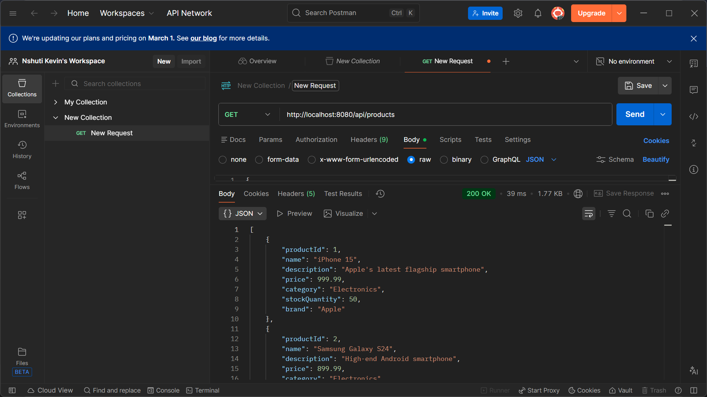
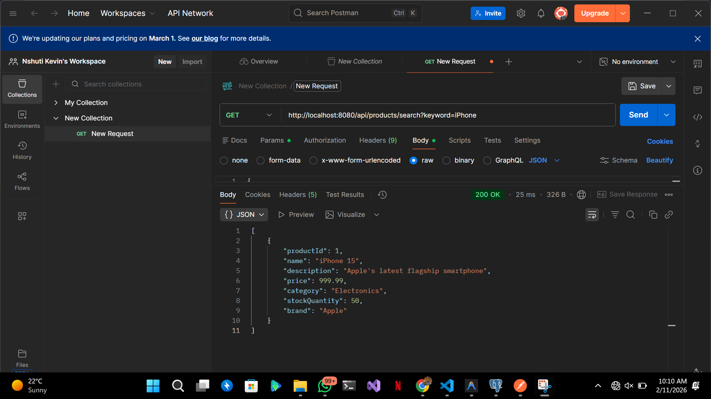
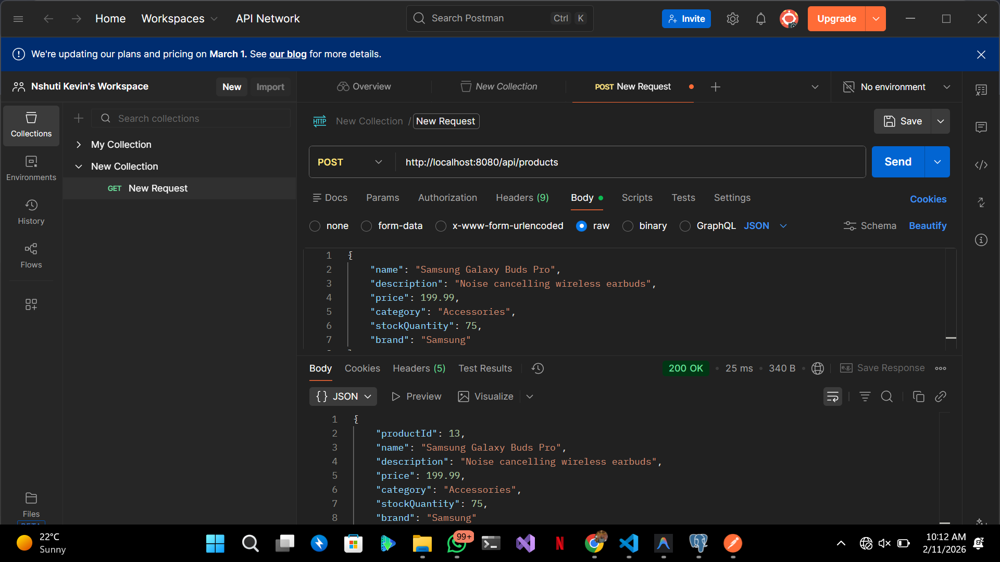
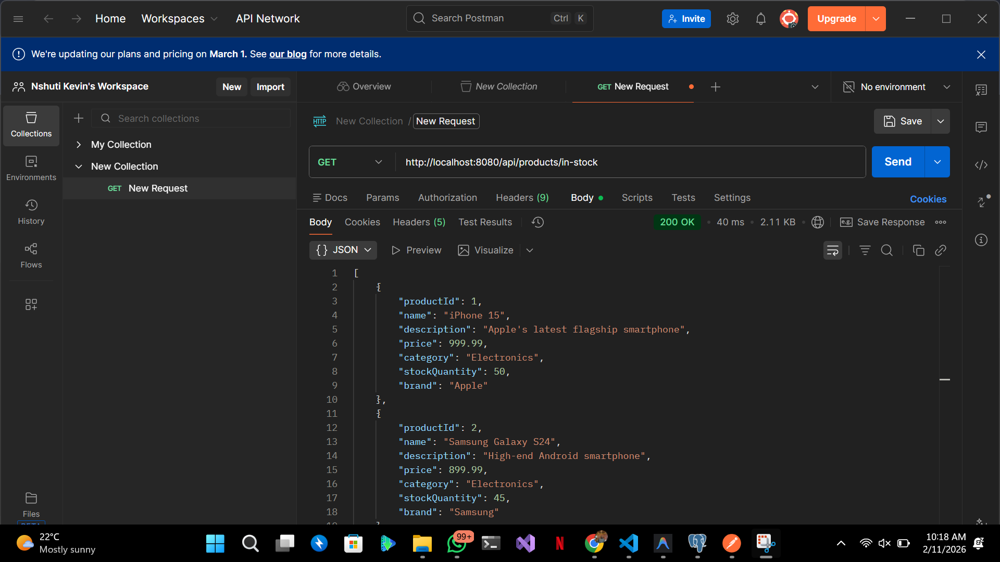
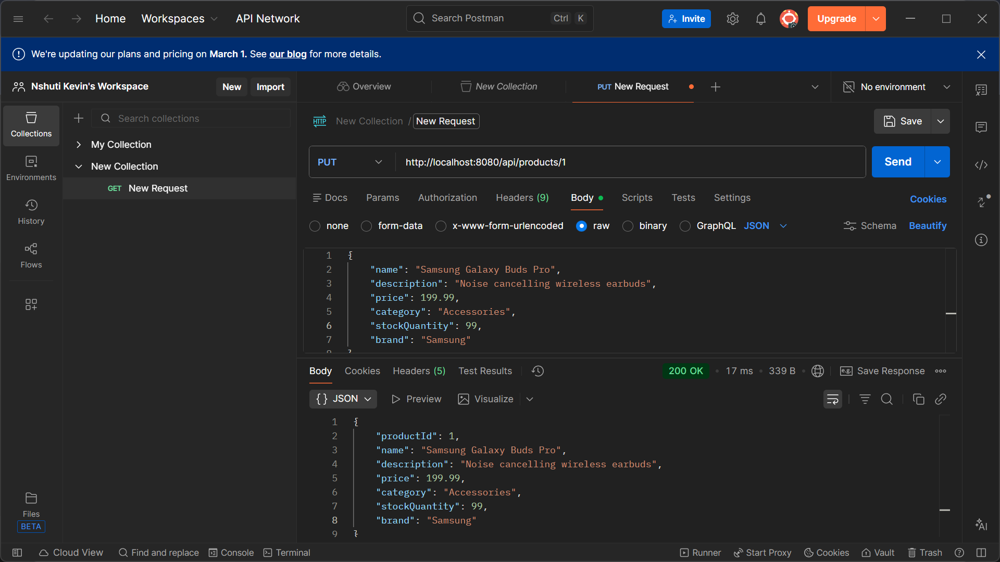
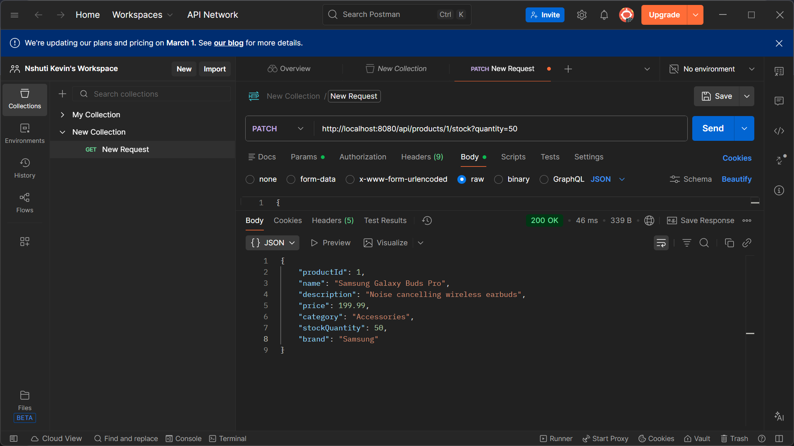
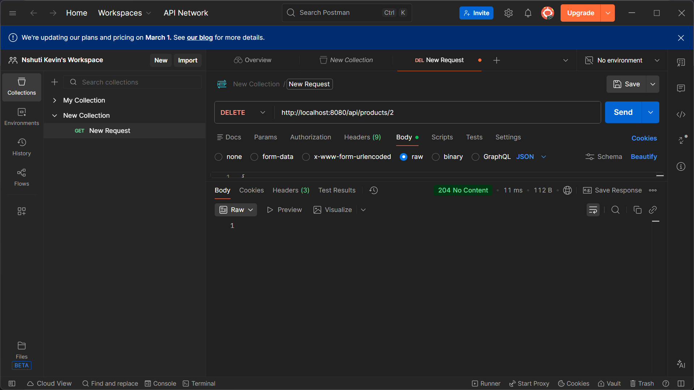

# E-Commerce Product API

A RESTful API for managing an e-commerce product catalog built with Spring Boot.

## 📋 Table of Contents
- [Features](#features)
- [Technologies Used](#technologies-used)
- [Prerequisites](#prerequisites)
- [How to Run the Application](#how-to-run-the-application)
- [API Endpoints](#api-endpoints)
- [Sample Requests and Responses](#sample-requests-and-responses)

## ✨ Features

- Retrieve all products in the catalog
- Search products by keyword (name)
- Get products that are in stock
- Add new products to the catalog
- Update existing products
- Update product stock quantity
- Delete products from the catalog
- RESTful API design with proper HTTP methods and status codes

## 🛠 Technologies Used

- **Java 17+**
- **Spring Boot 3.x**
- **Spring Web**
- **Maven**
- **Postman** (for API testing)

## 📦 Prerequisites

Before running this application, make sure you have the following installed:

- Java Development Kit (JDK) 17 or higher
- Maven 3.6+
- Your favorite IDE (IntelliJ IDEA, Eclipse, VS Code, etc.)
- Postman (optional, for testing endpoints)

## 🚀 How to Run the Application

### Step 1: Clone the Repository
```bash
git clone https://github.com/nshutiii/restFull_api_26663.git
cd E-Commerce-Product
```

### Step 2: Build the Project
```bash
mvn clean install
```

### Step 3: Run the Application
```bash
mvn spring-boot:run
```

Alternatively, you can run the application from your IDE by running the main application class.

### Step 4: Access the API
The application will start on `http://localhost:8080`

## 📡 API Endpoints

| Method | Endpoint | Description |
|--------|----------|-------------|
| GET | `/api/products` | Get all products |
| GET | `/api/products/search?keyword={keyword}` | Search products by keyword |
| GET | `/api/products/in-stock` | Get all products in stock |
| POST | `/api/products` | Add a new product |
| PUT | `/api/products/{id}` | Update a product |
| PATCH | `/api/products/{id}/stock?quantity={quantity}` | Update product stock |
| DELETE | `/api/products/{id}` | Delete a product |

## 📝 Sample Requests and Responses

### 1. Get All Products
**Request:**
```http
GET http://localhost:8080/api/products
```

**Response:** `200 OK`
```json
[
  {
    "productId": 1,
    "name": "iPhone 15",
    "description": "Apple's latest flagship smartphone",
    "price": 999.99,
    "category": "Electronics",
    "stockQuantity": 50,
    "brand": "Apple"
  },
  {
    "productId": 2,
    "name": "Samsung Galaxy S24",
    "description": "High-end Android smartphone",
    "price": 899.99,
    "category": "Electronics",
    "stockQuantity": 45,
    "brand": "Samsung"
  }
]
```

**Screenshot:**



---

### 2. Search Products by Keyword
**Request:**
```http
GET http://localhost:8080/api/products/search?keyword=iPhone
```

**Response:** `200 OK`
```json
[
  {
    "productId": 1,
    "name": "iPhone 15",
    "description": "Apple's latest flagship smartphone",
    "price": 999.99,
    "category": "Electronics",
    "stockQuantity": 50,
    "brand": "Apple"
  }
]
```

**Screenshot:**



---

### 3. Add a New Product
**Request:**
```http
POST http://localhost:8080/api/products
Content-Type: application/json

{
  "name": "Samsung Galaxy Buds Pro",
  "description": "Noise cancelling wireless earbuds",
  "price": 199.99,
  "category": "Accessories",
  "stockQuantity": 75,
  "brand": "Samsung"
}
```

**Response:** `200 OK`
```json
{
  "productId": 13,
  "name": "Samsung Galaxy Buds Pro",
  "description": "Noise cancelling wireless earbuds",
  "price": 199.99,
  "category": "Accessories",
  "stockQuantity": 75,
  "brand": "Samsung"
}
```

**Screenshot:**



---

### 4. Get Products In Stock
**Request:**
```http
GET http://localhost:8080/api/products/in-stock
```

**Response:** `200 OK`
```json
[
  {
    "productId": 1,
    "name": "iPhone 15",
    "description": "Apple's latest flagship smartphone",
    "price": 999.99,
    "category": "Electronics",
    "stockQuantity": 50,
    "brand": "Apple"
  },
  {
    "productId": 2,
    "name": "Samsung Galaxy S24",
    "description": "High-end Android smartphone",
    "price": 899.99,
    "category": "Electronics",
    "stockQuantity": 45,
    "brand": "Samsung"
  }
]
```

**Screenshot:**



---

### 5. Update a Product
**Request:**
```http
PUT http://localhost:8080/api/products/1
Content-Type: application/json

{
  "name": "Samsung Galaxy Buds Pro",
  "description": "Noise cancelling wireless earbuds",
  "price": 199.99,
  "category": "Accessories",
  "stockQuantity": 99,
  "brand": "Samsung"
}
```

**Response:** `200 OK`
```json
{
  "productId": 1,
  "name": "Samsung Galaxy Buds Pro",
  "description": "Noise cancelling wireless earbuds",
  "price": 199.99,
  "category": "Accessories",
  "stockQuantity": 99,
  "brand": "Samsung"
}
```

**Screenshot:**



---

### 6. Update Product Stock
**Request:**
```http
PATCH http://localhost:8080/api/products/1/stock?quantity=50
```

**Response:** `200 OK`
```json
{
  "productId": 1,
  "name": "Samsung Galaxy Buds Pro",
  "description": "Noise cancelling wireless earbuds",
  "price": 199.99,
  "category": "Accessories",
  "stockQuantity": 50,
  "brand": "Samsung"
}
```

**Screenshot:**



---

### 7. Delete a Product
**Request:**
```http
DELETE http://localhost:8080/api/products/2
```

**Response:** `204 No Content`

**Screenshot:**



---

## 📂 Project Structure

```
E-Commerce-Product/
├── src/
│   ├── main/
│   │   ├── java/
│   │   │   └── com/example/ecommerce/
│   │   │       ├── controller/
│   │   │       │   └── ProductController.java
│   │   │       ├── model/
│   │   │       │   └── Product.java
│   │   │       └── ECommerceProductApplication.java
│   │   └── resources/
│   │       └── application.properties
│   └── test/
├── screenshots/
│   ├── pic1.png (Get All Products)
│   ├── pic2.png (Search Products)
│   ├── pic3.png (Add New Product)
│   ├── pic5.png (Get In Stock Products)
│   ├── pic6.png (Update Product)
│   ├── pic7.png (Update Stock)
│   └── pic8.png (Delete Product)
├── pom.xml
└── README.md
```

## 🧪 Testing with Postman

1. Import the API endpoints into Postman
2. Set the base URL to `http://localhost:8080`
3. Test each endpoint with the sample requests provided above
4. Verify the responses match the expected outputs

## 📄 License

This project is created for educational purposes as part of a RESTful API assignment.

## 👤 Author

**Nshuti Kevin**
- GitHub: [@nshutiii](https://github.com/nshutiii)
- Repository: [restFull_api_26663](https://github.com/nshutiii/restFull_api_26663)

---

**Note:** This is a simple in-memory implementation. Data will be lost when the application restarts. For production use, consider integrating a database like PostgreSQL or MySQL.
